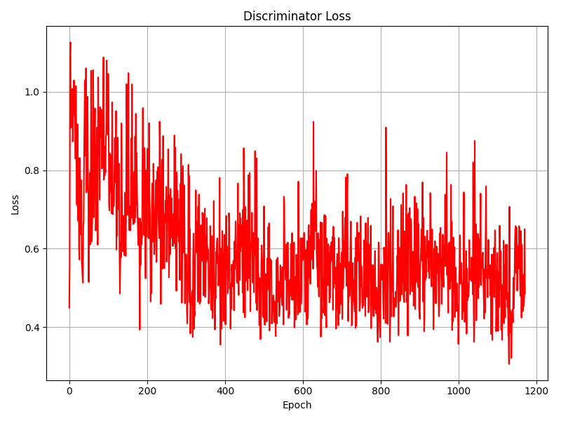
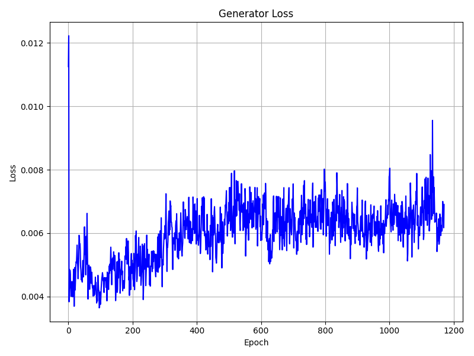

# SRGAN Code Replication

Notebook in SRGAN.ipynb

### Hyperparameter used

NUM_EPOCHS = 1000

BATCH_SIZE = 16

LEARNING_RATE = 1e-4

**Failed to replicate results from paper as claimed**

### Test Result

Low Res Input/High Res Output

Low Res Input/High Res Output

Low Res Input/High Res Output

### Loss Graph

### Findings and Discussions

#### Things I observe

1. The loss for Generator fluactuate around 0.007 after ~1000 epochs.
2. The loss for Discriminator fluctate around 0.35 after ~1000 epochs.

#### Reason The Replication isn't success

1. The paper mentioned the network was trained on 10^5 epoch with learning rate 10^-4 and another 10^5 at learning rate 10^-5. Whereas I only train for ~1000 epoch
2. The paper mentioned 'We employed the trained MSE-based SRResNet
   network as initialization for the generator when training
   the actual GAN to avoid undesired local optima' which I did not pre-train. This could be the problem the network is not converging.
3. My training is bottlenecked by data loader pipeline, where I randomly crop 96x96 for each image.

#### Things I don't understand

1. It's interesting to know that the architecture work with the feature at low dimension for many blocks rather than upscaled high dimension features.
2. The paper mentioned to multiple VGG Loss of of a factor of 0.006, resulting in the loss function of 0.006 * VGG Loss + 0.001 * BCE Loss, which is left unexplained.
3. Mean Opinion Score (MOS), although calibrated, is sketchy and hard to be chosen as a test metric.
