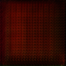

# SRGAN Code Replication

Notebook in SRGAN.ipynb

### Hyperparameter used
NUM_EPOCHS = 1000

BATCH_SIZE = 16

LEARNING_RATE = 1e-4

### Findings and Discussions
1. The loss for Generator converge around 0.008 after ~1000 epochs.
2. The loss for DIscriminator converge around 0.35 after ~1000 epochs.
3. It's interesting to know that the architecture work with the feature at low dimension for many blocks rather than upscaled high dimension features.
4. The paper mentioned to multiple VGG Loss of of a factor of 0.006, resulting in the loss function of 0.006 * VGG Loss + 0.001 * BCE Loss

### Model result

**Failed to replicate results from paper as claimed**

Low Res Input/High Res Output

Low Res Input/High Res Output

Low Res Input/High Res Output

Low Res Input/High Res Output

